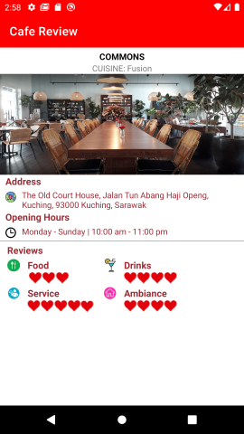

# Assignment 1

In this assignment, we learned to get familiarized with the SDK, Emulator and IDE of Android Studio. We also explore various layouts and create simple apps to apply these layouts to them. Besides, we learned to achieve fluid layouts on different screen sizes.
