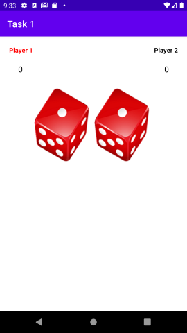
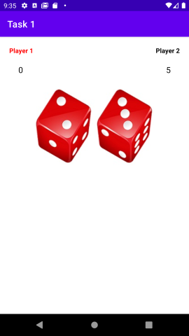
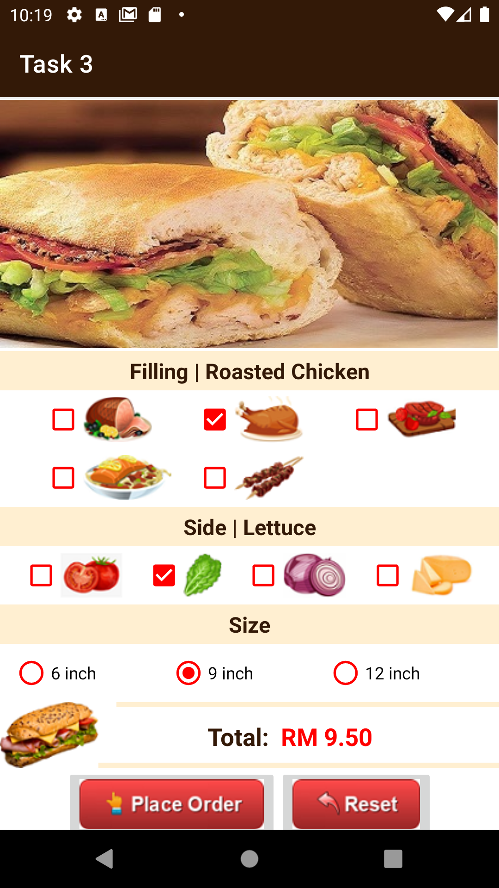
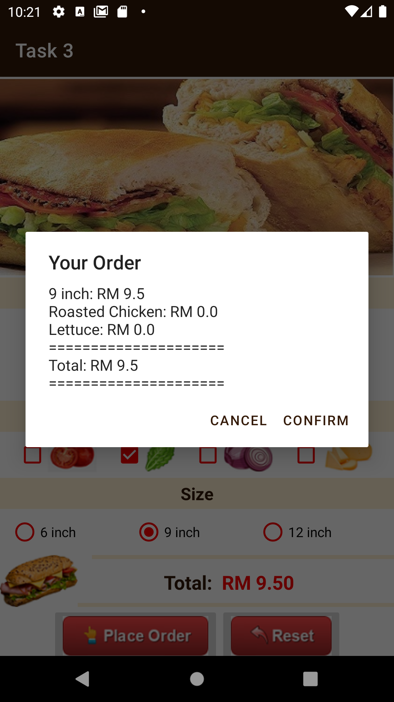

# Assignment 2

In this assignment, we were tested on our programming logic and get familiarised with Android Porgramming in Kotlin. We learned about the concept of string externalisation. We also learned how to manage UI event listeners and device rotation, create AlertDialogBox and use HashMap to store data.

## Task 1: Device rotation game

This is a simple device rotation game for two players. They rotate the phone to get new dice numbers. Player 1 will only get the score if they get even number while player 2 gains the score if they get odd number. 

    
    
    

## Task 2: A simple food menu platform

This is a simple food menu platform for users to view menu, and view order. We learned to use UI event listeners to display the selected item on the screen after being clicked. 

    
    
    

