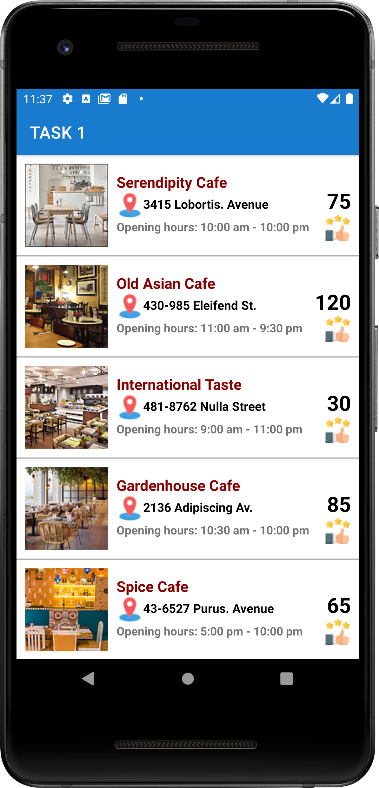
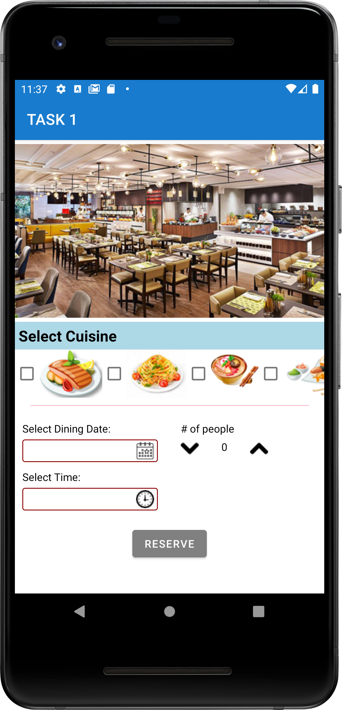
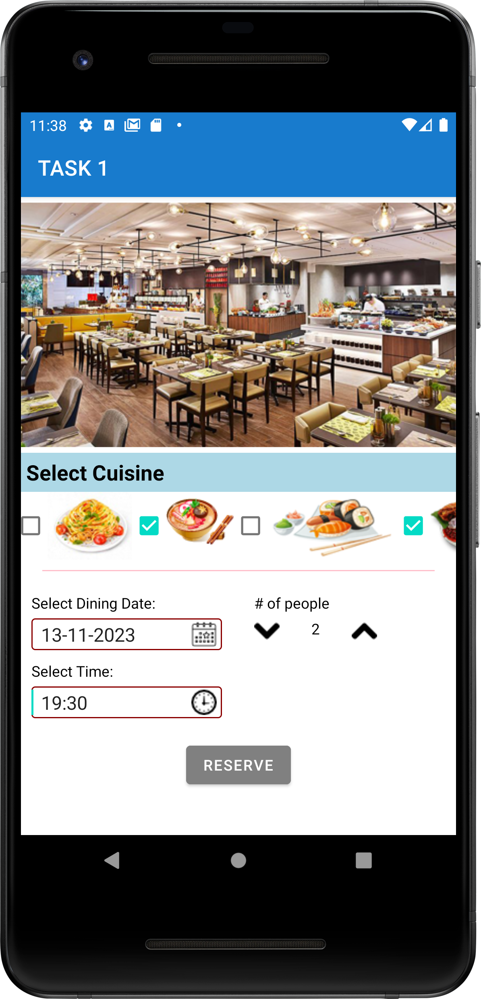
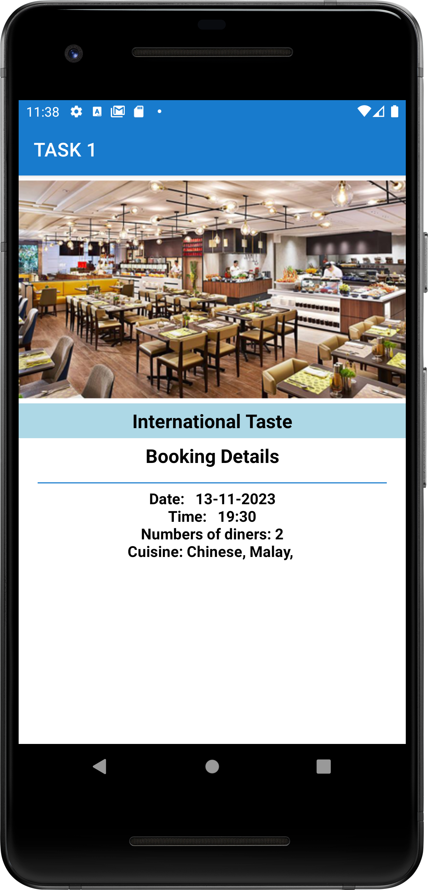
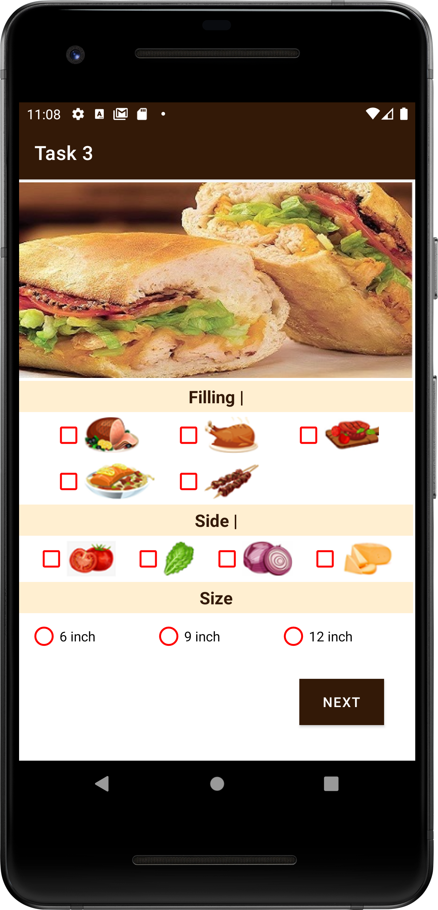
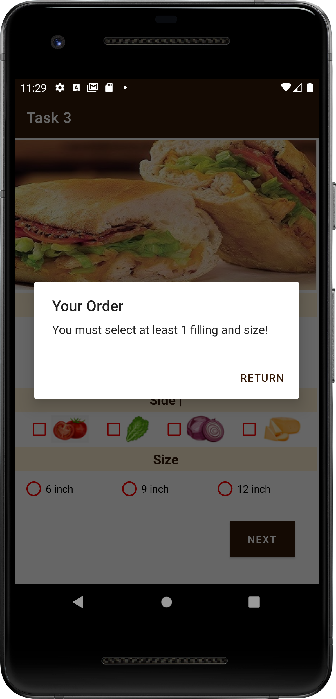
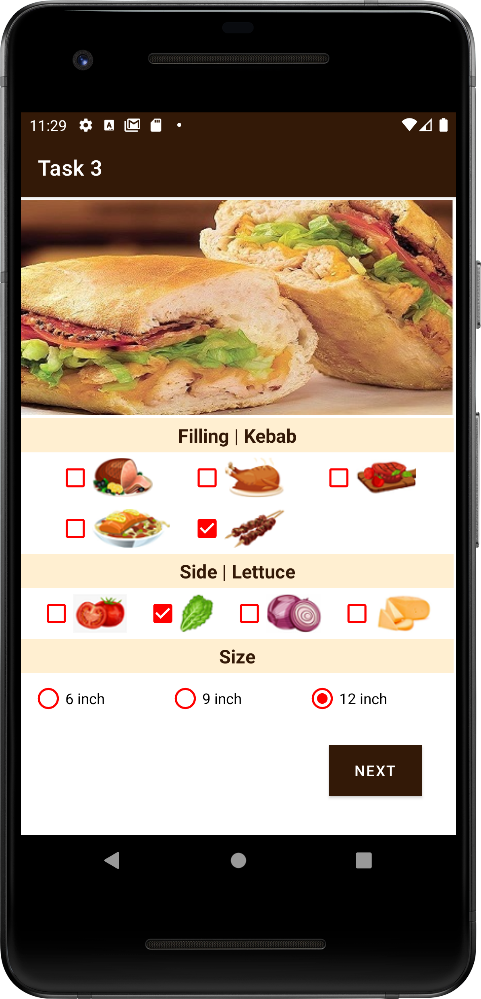
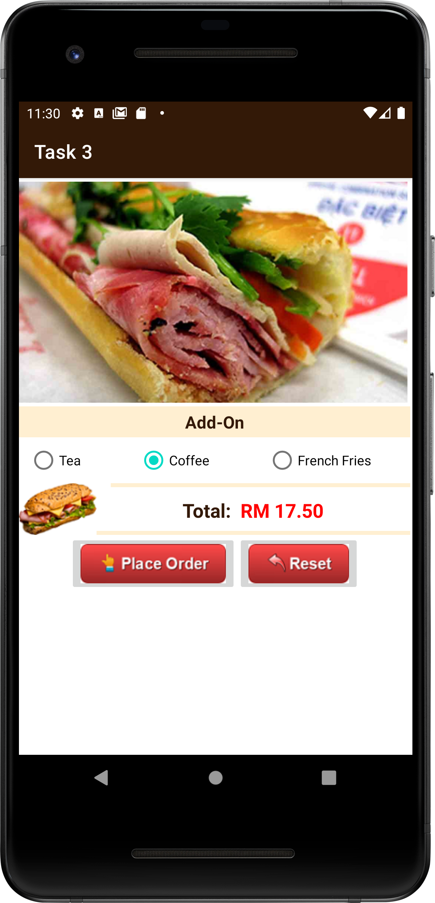
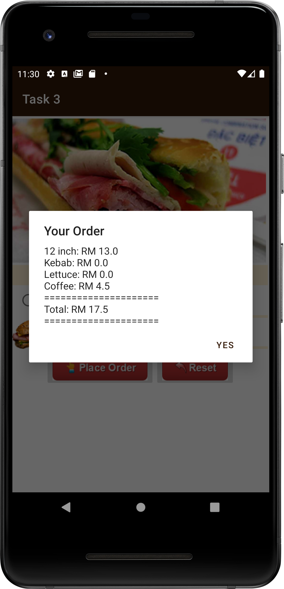

# Assignment 3

In this assignment, we learned how to work with RecyclerView to optimize performance.  We also learned to create apps with multiple activities and passed objects between activitites using Parcelable objects and intents. Besides, we explore the use of fragments and the communications between fragments to learn to support dynamic UI.

## Task 1: Cafe booking

This is a simple cafe booking app. We use recycler view to display all the cafe options in main activity 1. After clicking on one of the cafes, the parcelable object(cafe) will be passed to the main activity 2. The content view will then be changed to display the reservation details after "reserve" button is clicked. 

    
    &nbsp;
    
    &nbsp;
    
    &nbsp;
    

## Task 2: Sandwich App 2

This is the continuation of the sandwich app from assign 2. We use fragments to navigate different pages. The main activity is used to manage two fragments and implement the interfaces in both fragments to handle button clicks and data passing between fragments. After selecting all the required fields and clicking on the "next" button, the fragment 2 will be displayed to view the order. 

    
    &nbsp;
    
    &nbsp;
    
    &nbsp;
    
    &nbsp;
    

