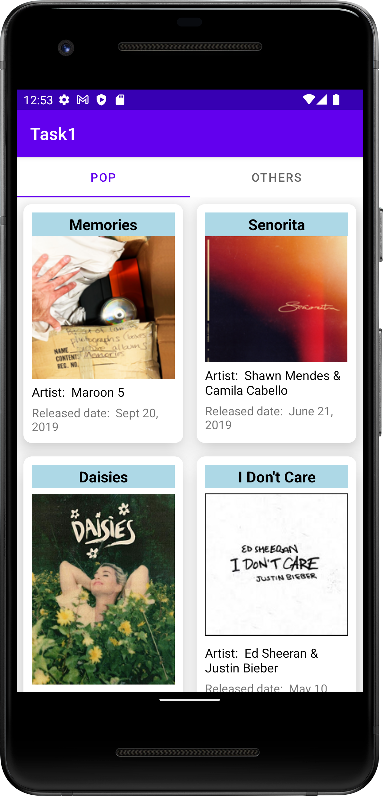
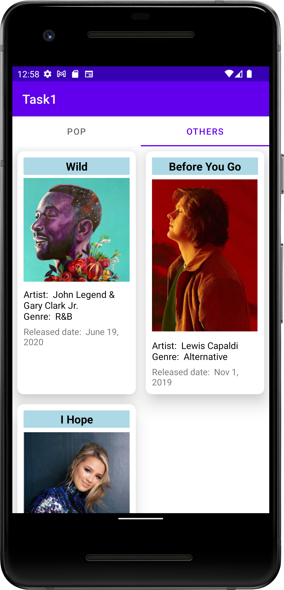
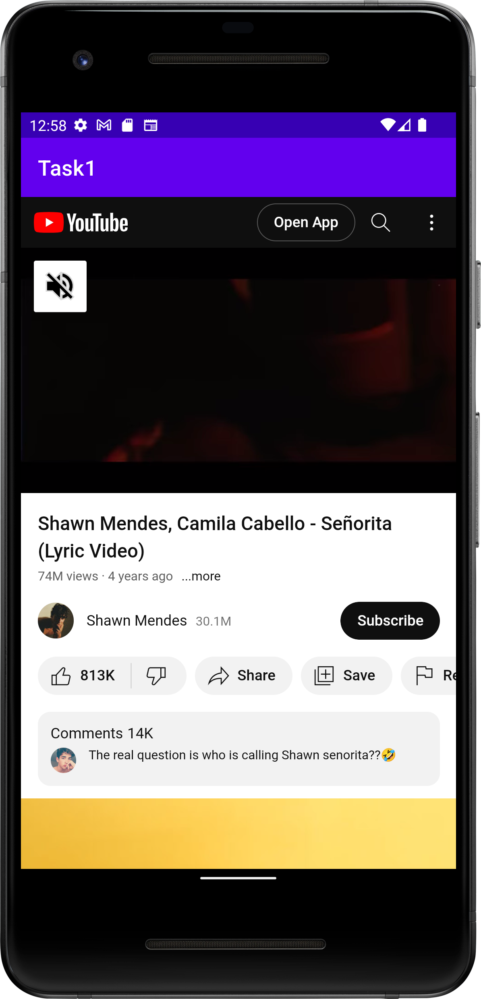
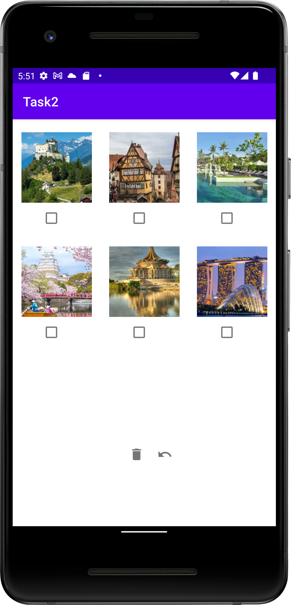
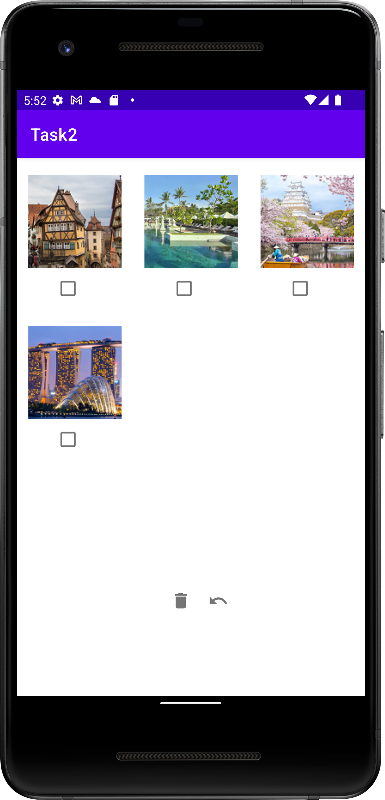
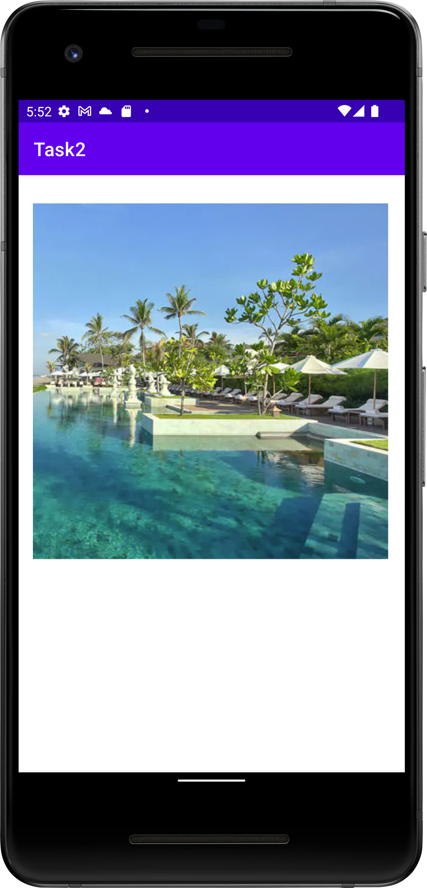

# Assignment 4

In this assignment, we learned to use material design componenets such as CardView widget, Staggered GridLayout and Tabbed Layout. We also learned how to read text file and retrieve the data from it in Kotlin. Besides, we set up a HTTP web server using Xampp and send a HTTP request using the Retrofit to retrieve data and Glide library to load the images. 

## Task 1: Song List App 

This is a simple image gallery app which reads the text file to get the song list and each of the website URL. We use material design components such as CardView widget and staggered GridLayout to display the song list in a fragment. Besides, we use Tabbed Layout to navigate through two different fragments. After one of the songs in the list is clicked, we use web view to display the YouTube music video. 

    
    &nbsp;
    
    &nbsp;
    

## Task 2: Image Gallery App

This is a simple image gallery app which retrieves data from localhost XAMPP database and displays them with checkboxes. We use Retrofit to retrieve data and Glide library to load the photos retrieved.

    
    &nbsp;
    
    &nbsp;
    
    &nbsp;
    

