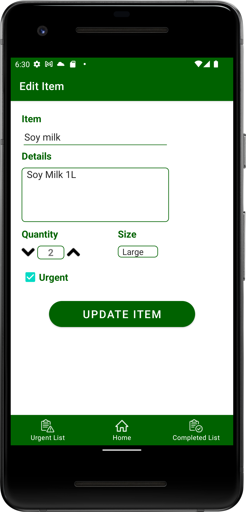

# Assignment 5

In this assignment, we learned to incorporate with all the things we have learned throughout this semester and also demonstrated competency at using the SQLite to perform CRUD functions. Besides, we also learned how to implement the floating action button.

## Shopping list app

This is a simple shopping list app which allows users to add (urgent/non-urgent) items to the shopping list and manage the list. We use bottom navigation view to manage between fragments. The items data are stored in the local database SQLite and we perform CRUD functions to create, read, update and delete data from the database.

    
    &nbsp;
    
    &nbsp;
    
    &nbsp;
    
    &nbsp;
    
    &nbsp;
    

