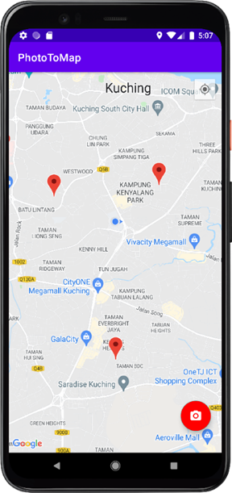
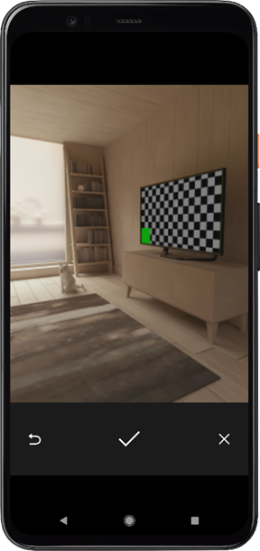
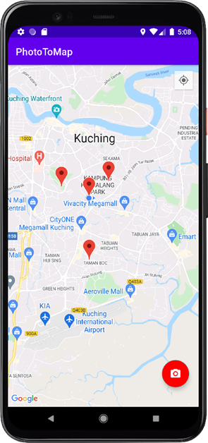
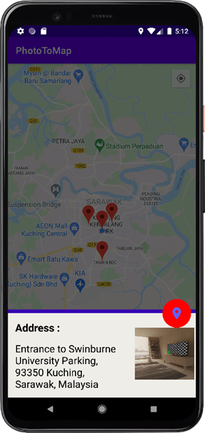

# Assignment 6

In this assignment, we explored the use of camera API, Google Map v2 and MapView widgets. We also performed reverse geocoding with Google Maps Geocoding API service. 

## PhotoToMap app

This is an app which allows users to capture the location and image using the default camera app. Different locations stored in the SQLite database are retrieved and displayed on the Google Map using MapView widget.

    
    &nbsp;
    
    &nbsp;
    
    &nbsp;
    

