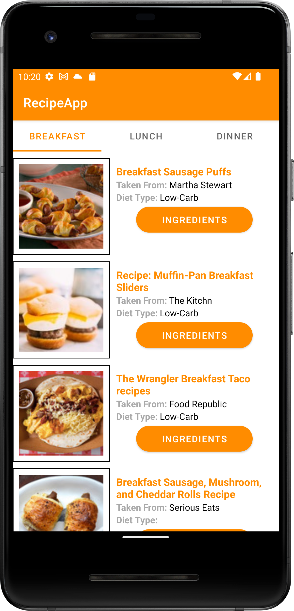
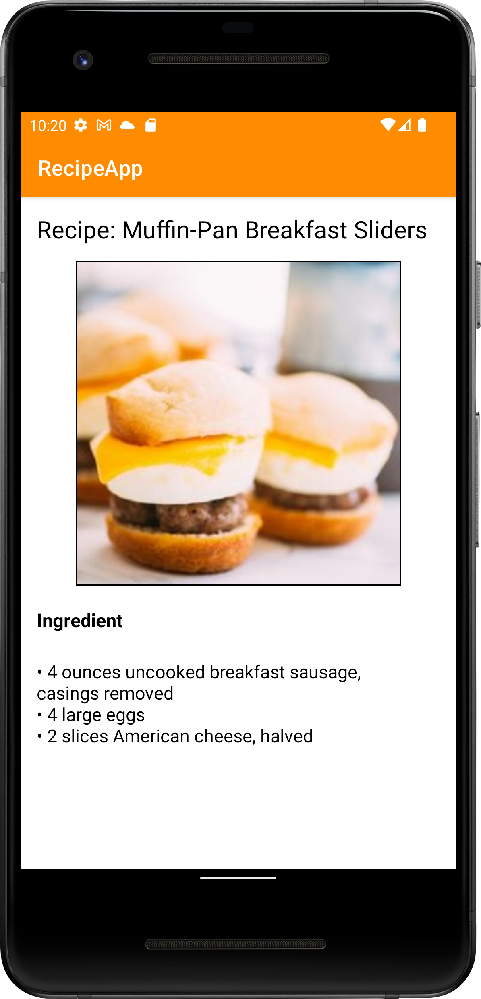

# Assignment 7

In this assignment, we learned how to adopt seamless integration with open REST-based APIs and parse JSON data structure. 

## Recipe app

This app is an app which retrieves recipes online using open REST-based APIs and parse JSON data structure. The recipe images are loaded using Retrofit and Glide library.

    
    &nbsp;
    
    &nbsp;

